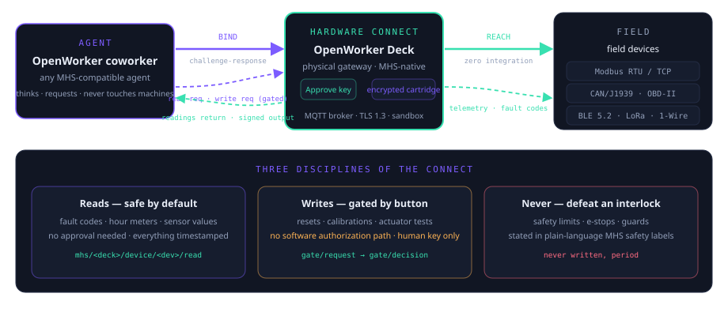

# Hardware binding: OpenWorker Deck

**The agent's hardware connect.** The agent thinks — the Deck connects. An
MHS-compatible physical gateway that binds an OpenWorker coworker to the
physical world: one connect, two directions (the agent reaches down to
machines; telemetry and fault codes flow back up), all writes passing a
human-pressed button. Two roles in one device:

1. **Desk console** — a 4″ screen mirroring the coworker's live todo list and
   progress, with a physical Approve/Deny permission card and a status ring
   (idle / thinking / needs-you). When the agent requests a permission in
   `interactive` mode, the desk rings instead of a chat bubble.
2. **Device gateway** — an industrial + wireless gateway speaking Modbus
   RTU/TCP, CAN 2.0B/J1939, OBD-II, BLE 5.2 and LoRa, registering itself and
   every bridged device on the network following the MHS pattern.

This document defines how an OpenWorker agent binds to and operates a Deck.
Product specifications live in the upstream repository; this binding covers the
integration surface only.



## 1. Discovery and registration

The Deck registers itself and each bridged device as an MHS-compatible node:

- Standard read/write interface per device class
- Natural-language safety labels auto-generated from device metadata
- Device registry entries persist locally; re-discovery is idempotent

An OpenWorker agent discovers the Deck like any other MHS node — no
vendor-specific client. Any MHS-compatible agent (OpenWorker, Claude, or
others) can bind; the Deck is agent-agnostic.

## 2. Binding protocol

The connect itself — transport, security, and the topic tree that carries
both directions:

| Layer | Mechanism |
|---|---|
| Transport | Built-in MQTT broker (3.1.1 / 5.0), LWT presence, topic tree per MHS↔topic mapping |
| Security | TLS 1.3; cartridge challenge-response — the agent must satisfy a hardware-anchored challenge before write access |
| Presence | LWT marks the agent offline on the network layer; the console reflects it on the status ring |
| Time | Fleet time sync across multiple Decks for correlated telemetry |

Topic tree sketch:

```
mhs/<deck-id>/console/todo          # agent publishes live todo list
mhs/<deck-id>/console/progress      # agent publishes progress panel state
mhs/<deck-id>/gate/request          # agent requests a permission
mhs/<deck-id>/gate/decision         # Deck publishes Approve/Deny (human-pressed)
mhs/<deck-id>/device/<dev>/read     # telemetry reads (safe by default)
mhs/<deck-id>/device/<dev>/write    # actuation, calibration, resets (gated)
mhs/<deck-id>/audit                 # per-call audit stream
```

## 3. Read/write discipline

- **Reads are safe by default.** Fault codes, hour meters, cycle counts, sensor
  readings, error history — no approval needed. Every reading is timestamped
  and names its source device.
- **Writes are gated.** Resets, calibration values, actuation tests: the agent
  publishes to `gate/request` stating what it commands, what the machine will
  physically do, and what could go wrong. The human presses Approve or Deny on
  the physical card. No software path grants a write.
- **Never write to defeat an interlock, guard, or limit** — the Deck's safety
  labels carry this in plain language per MHS.

## 4. The physical permission gate

When the bound agent enters `interactive` mode and requests a permission:

1. The Deck rings the desk — a physical card with Approve / Deny buttons.
2. The request and its context are displayed on the console.
3. The human's button press is the only path to a grant. The decision is
   published to `gate/decision` and logged to the audit stream.
4. Authorization is per-action, not per-session — a grant does not carry over.

The same gate hardware also enforces **model-call authorization**. External
models (an institution's own, reviewed at onboarding — BYOM) run in a sandbox
and may only read the fields a consent card declares; they leave with signed
inference outputs, never raw data. No consent card, no call — there is no
bypass path and no direct API in the architecture, and a revocation cuts the
model's next call immediately.


## 5. Privacy model

- The agent's private data (telemetry, logs, history) is computed on the Deck's
  local model and stays on the device by default. Offline is the resting state.
- History archives to a removable hardware-encrypted cartridge (AES-256, key
  lives in the cartridge). Pulling the cartridge removes the data physically;
  compute continues with telemetry buffering to eMMC and syncs on re-insert.
- The optional fleet bridge is opt-in and labeled.

## 6. Audit

Every model call and every write generates an audit record: who called, what
was read or written, when, and under which authorization. The audit stream is
available to the bound agent for review but is append-only — entries cannot
be rewritten from the agent side.

## 7. Sensing modalities (for agents without diagnostic ports)

Four contactless modalities work on any machine with power: vibration
(3-axis accelerometer), thermal (IR thermopile), current signature (CT clamp),
and acoustic (MEMS mic). These feed anomaly detection and risk prediction on
the local model — the agent reads the derived risk briefs, not raw streams.

## 8. Product editions

One binding, four form factors — an agent that binds one Deck can operate any
edition; the topic tree and disciplines are identical:

| Edition | Form factor | Where it lives |
|---|---|---|
| Desktop | 4″ console, Approve/Deny permission card, status ring | On the desk, next to the agent's host |
| Industrial | 35 mm DIN-rail, RS-485/CAN terminal blocks, RJ45, LoRa antenna, passive heatsink, wide-temp | Inside the cabinet, on the rail |
| Socket | Smart-plug with pass-through outlet, built-in current sensing | In the wall outlet — zero-wiring entry; the appliance plugs into it |
| Pendant | Screenless guardian tag, GNSS + barometer + nano-SIM | On the person — tracks and check-ins flow up through any nearby Deck |

## 9. Protocol support

Every protocol maps onto the same standard MHS read/write interface — the agent
never learns a vendor SDK:

| Link | Reaches | Typical equipment |
|---|---|---|
| Modbus RTU (RS-485 multi-drop) | PLCs, VFDs, meters, controllers | Compressors, sterilizers, pump stations |
| Modbus TCP (Ethernet) | Panel PCs, gateways, SCADA-adjacent devices | Machine tools, energy meters |
| CAN 2.0B / J1939 | Vehicle and heavy-equipment buses | Trucks, gensets, ag machinery |
| OBD-II | Passenger-vehicle diagnostics | Fleet vans, work trucks |
| BLE 5.2 | Sensors, health devices, wearables | Blood-pressure cuffs, tag buttons, env pods |
| LoRa | Long-range, low-power telemetry | Barns, tanks, remote sites |
| 1-Wire | Cheap temperature chains | Cold storage, server rooms |

## 10. Compute and storage

Two planes, deliberately separated — compute stays in the base, data travels
in the cartridge:

- **Compute plane** — dual-core Cortex-A7 + 0.5 TOPS NPU: the local model,
  anomaly detection, feature learning, and the MQTT broker run on the device.
- **Storage plane** — 8 GB eMMC buffer plus a removable hardware-encrypted
  cartridge (AES-256, key born in the cartridge, never leaves). Pulling the
  cartridge removes the archive physically; compute keeps running and syncs
  on re-insert.

## 11. Status

Design-stage hardware; EVT-phase target specs. Firmware is open source (MIT).
MHS is a research preview — this binding tracks the spec as it stabilizes and
degrades gracefully: no registration found means the normal case, and the
agent falls back to its other paths.

Product documentation, industrial design renders, and specification tables:
[github.com/Hdhaidong/openworker-deck](https://github.com/Hdhaidong/openworker-deck)

Independent community project — not affiliated with, endorsed by, or sponsored
by Andrew Ng, deeplearning.ai, or the OpenWorker project.
